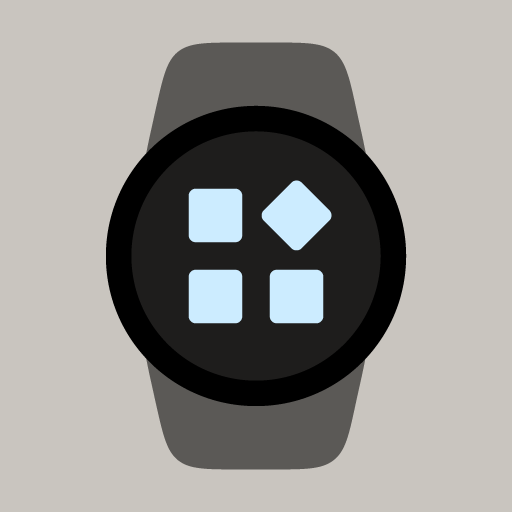

#  Complications Suite - Wear OS

[](https://github.com/amoledwatchfaces/Complications-Suite-Wear-OS/actions/workflows/build-and-release.yml)
[](https://developer.android.com/wear)
[](https://github.com/amoledwatchfaces/Complications-Suite-Wear-OS/releases)
[](https://github.com/amoledwatchfaces/Complications-Suite-Wear-OS/blob/master/LICENSE.md)
[](https://amoledwatchfaces.github.io/apps/privacy/complicationssuite.html)

Add missing Custom Complications to your Wear OS Watch Face. Customize dates, calendars, settings shortcuts, battery metrics, seconds, location-based moon/sun phases, and more.

---

## 🧩 Included Complication Services

This suite provides 42 custom complications for your watch faces:

| Complication Service | Supported Wear OS Complication Types | Description |
|:---|:---|:---|
| **Activity launcher** | `ICON` | Launches a custom user-selected app or activity. |
| **Alarm** | `ICON`, `SMALL_IMAGE` | Displays the shortcut for alarm clock app. |
| **Amoled Logo** | `ICON`, `SMALL_IMAGE` | Displays the amoledwatchfaces™ branding logo. |
| **Assistant (Monochrome)** | `ICON`, `SMALL_IMAGE` | Fast launcher shortcut for Google Assistant. |
| **Barometer** | `SHORT_TEXT` | Displays current atmospheric pressure in hPa or inHg. |
| **Battery Saver settings** | `ICON` | Quick access shortcut to system battery saver settings. |
| **Bluetooth settings** | `ICON` | Quick access shortcut to system Bluetooth settings. |
| **BTC (Bitcoin) price** | `SHORT_TEXT`, `LONG_TEXT`, `RANGED_VALUE` | Tracks current Bitcoin (BTC) market price in USD. |
| **Countdown to date** | `SHORT_TEXT`, `LONG_TEXT`, `RANGED_VALUE` | Displays countdown in days/hours to a user-defined date. |
| **Custom goal** | `SHORT_TEXT`, `LONG_TEXT`, `RANGED_VALUE` | Tracks progress towards custom targets with increment/decrement buttons. |
| **Custom text** | `SHORT_TEXT`, `LONG_TEXT` | Displays static custom text or title configured by the user. |
| **Date** | `SHORT_TEXT`, `LONG_TEXT` | Displays today's date with customizable formatting options. |
| **Date Hijri** | `SHORT_TEXT`, `LONG_TEXT` | Displays the current date in Islamic Hijri format. |
| **Date Jalali** | `SHORT_TEXT`, `LONG_TEXT` | Displays the current date in Persian Jalali format. |
| **Day and Week** | `SHORT_TEXT`, `LONG_TEXT` | Shows the current day of the year and week of the year. |
| **Day of Year** | `SHORT_TEXT`, `LONG_TEXT`, `RANGED_VALUE` | Shows the current day number out of 365/366 with progress. |
| **Developer Options** | `ICON`, `SMALL_IMAGE` | Quick access shortcut to developer options settings. |
| **Dice** | `ICON`, `SMALL_IMAGE` | Tap to roll a virtual 6-sided dice and see the result. |
| **Display settings** | `ICON` | Quick access shortcut to display brightness settings. |
| **Dynamic calendar icon** | `ICON`, `SMALL_IMAGE` | Displays a calendar icon showing the current day of the month dynamically. |
| **ETH (Ethereum) price** | `SHORT_TEXT`, `LONG_TEXT`, `RANGED_VALUE` | Tracks current Ethereum (ETH) market price in USD. |
| **Flashlight** | `ICON`, `SMALL_IMAGE` | Opens a white screen utility for emergency lighting. |
| **Kanji day of week** | `ICON`, `SMALL_IMAGE` | Displays the current day of the week in Japanese Kanji characters. |
| **Moon Phase** | `SHORT_TEXT`, `LONG_TEXT`, `RANGED_VALUE`, `ICON`, `SMALL_IMAGE` | Shows the current moon phase name, illustration, and percent illumination. |
| **Moonrise & Moonset** | `SHORT_TEXT`, `LONG_TEXT`, `RANGED_VALUE` | Displays the estimated moonrise and moonset times. |
| **NFC settings** | `ICON` | Quick access shortcut to system NFC settings. |
| **Pay** | `ICON`, `SMALL_IMAGE` | Quick shortcut to launch Google Pay / Samsung Pay. |
| **Seconds** | `SHORT_TEXT`, `LONG_TEXT`, `RANGED_VALUE` | Displays live ticking seconds on the watch face. |
| **Settings** | `ICON` | Quick access shortcut to primary system settings. |
| **Sunrise & Sunset** | `SHORT_TEXT`, `LONG_TEXT` | Displays the local sunrise and sunset times based on location. |
| **Sunrise & Sunset countdown** | `SHORT_TEXT`, `LONG_TEXT`, `RANGED_VALUE` | Shows time remaining until the next sunrise or sunset. |
| **Swatch Internet Time** | `SHORT_TEXT`, `LONG_TEXT`, `RANGED_VALUE` | Displays the current Swatch Internet Time (.beats). |
| **Time** | `SHORT_TEXT`, `LONG_TEXT`, `RANGED_VALUE` | Displays customizable digital time format (12h/24h). |
| **Time zone** | `SHORT_TEXT`, `LONG_TEXT` | Displays name or offset of the current timezone. |
| **Timer** | `SHORT_TEXT`, `RANGED_VALUE` | Custom countdown timer with pick-time configuration. |
| **Volume control** | `ICON`, `SMALL_IMAGE` | Quick shortcut to system volume settings. |
| **Water intake** | `SHORT_TEXT`, `LONG_TEXT`, `RANGED_VALUE`, `ICON`, `SMALL_IMAGE` | Tracks daily water intake logging and progress. |
| **Wear OS logo** | `ICON`, `SMALL_IMAGE` | Displays a Wear OS brand icon decoration. |
| **Week of Year** | `SHORT_TEXT`, `LONG_TEXT`, `RANGED_VALUE`, `ICON`, `SMALL_IMAGE` | Shows the week of the year in US or ISO format with progress. |
| **Wi-Fi settings** | `ICON` | Quick access shortcut to system Wi-Fi settings. |
| **World Clock 1** | `SHORT_TEXT`, `LONG_TEXT` | Shows current time in a configured alternative timezone. |
| **World Clock 2** | `SHORT_TEXT`, `LONG_TEXT` | Shows current time in another configured alternative timezone. |

---

## 📸 Previews

<p align="center">
  
  
  
  
</p>

---

## ⚙️ App Settings & Configuration

The app settings screen on Wear OS allows you to customize each complication directly on your watch (e.g. date formats, world clocks, custom text, moon phase location, and custom goal targets).

<p align="center">
  
  
  
  
  
</p>

<details>
<summary><b>Show more settings screenshots</b></summary>
<br>
<p align="center">
  
  
  
  
  
</p>
</details>

---

## 🚀 Installation & Releases

### Google Play Store
You can install the app directly on your Wear OS watch via the Play Store:
<br>
<a href='https://play.google.com/store/apps/details?id=com.weartools.weekdayutccomp'></a>

For more information, see our [Privacy Policy](https://amoledwatchfaces.github.io/apps/privacy/complicationssuite.html).

### Sideload / Manual Install
Download the compiled package (`.apk`) directly from our [Releases Page](https://github.com/amoledwatchfaces/Complications-Suite-Wear-OS/releases) and sideload it onto your watch.

---

## 🛠️ Local Build & Setup

To compile the application locally using Android Studio:

1. **Clone the repository**:
   ```bash
   git clone https://github.com/amoledwatchfaces/Complications-Suite-Wear-OS.git
   cd Complications-Suite-Wear-OS/Complications_Suite_AS
   ```
2. **Add API Keys (Optional)**:
   The app uses Google Places for location searches. You can configure your key by creating a folder named `APIs` in the root of the workspace (parent directory of `Complications_Suite_AS`) and creating a file `apis.properties` inside it:
   ```properties
   PLACES_API_KEY = "your_google_places_api_key_here"
   ```
   *Note: If you do not have an API key, the build will fallback to an empty string and compile successfully.*

3. **Build the project**:
   Use Android Studio or Gradle CLI:
   ```bash
   ./gradlew assembleDebug
   ```

---

## 📄 License

This project is licensed under the **GNU General Public License v3.0 (GPLv3)**. 

Copyright (c) 2024 - 2026 amoledwatchfaces™

See the [LICENSE.md](LICENSE.md) file for the full license text.
