#  Complications Suite - Wear OS

[](https://github.com/amoledwatchfaces/Complications-Suite-Wear-OS/actions/workflows/build-and-release.yml)
[](https://developer.android.com/wear)
[](https://github.com/amoledwatchfaces/Complications-Suite-Wear-OS/releases)
[](https://github.com/amoledwatchfaces/Complications-Suite-Wear-OS/blob/master/LICENSE.md)

Add missing Custom Complications to your Wear OS Watch Face. Customize dates, calendars, settings shortcuts, battery metrics, seconds, location-based moon/sun phases, and more.

---

## 📸 Previews

<p align="center">
  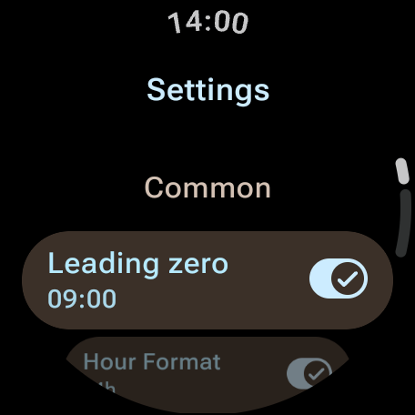
  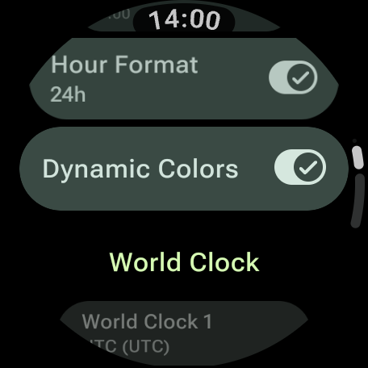
  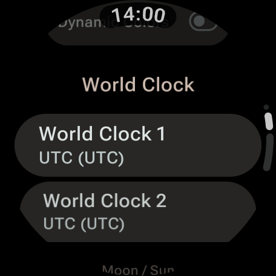
  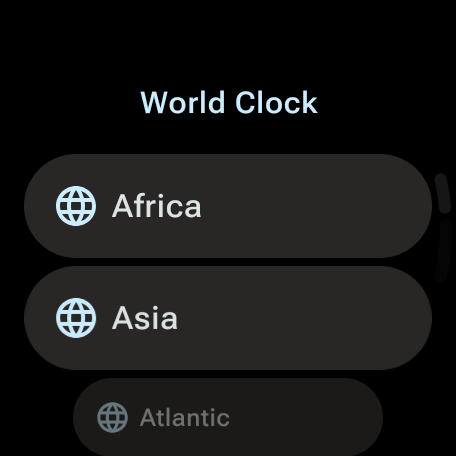
</p>

---

## ⚙️ App Settings & Configuration

The app settings screen on Wear OS allows you to customize each complication directly on your watch (e.g. date formats, world clocks, custom text, moon phase location, and custom goal targets).

<p align="center">
  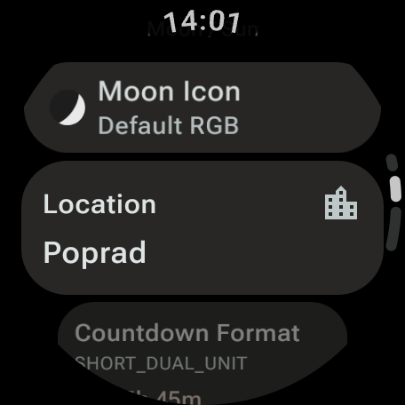
  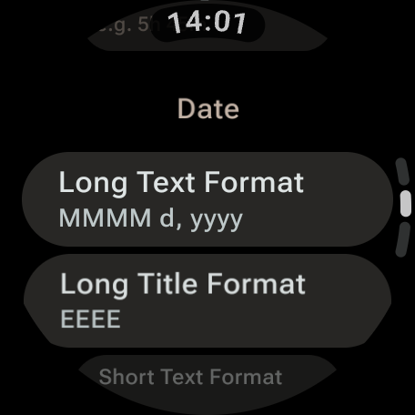
  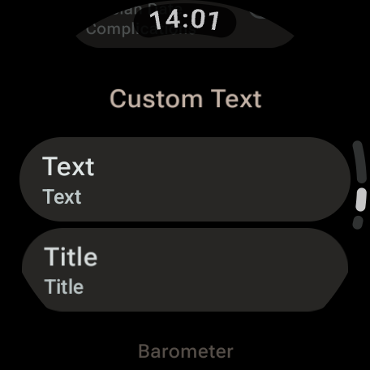
  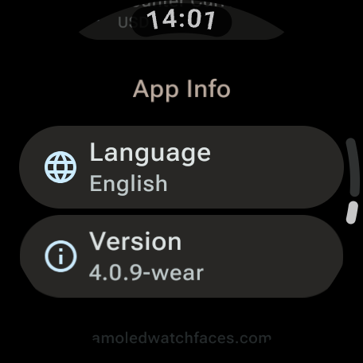
  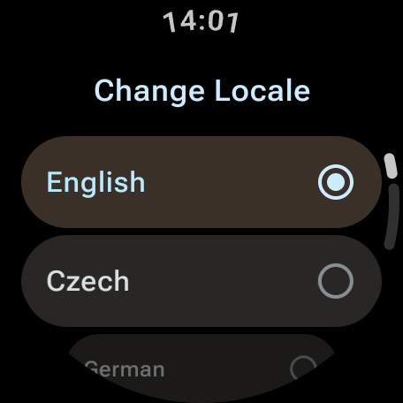
</p>

<details>
<summary><b>Show more settings screenshots</b></summary>
<br>
<p align="center">
  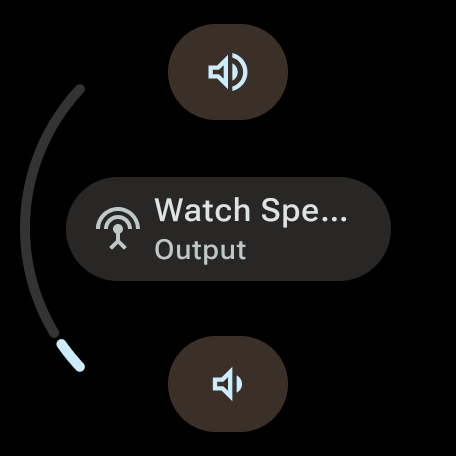
  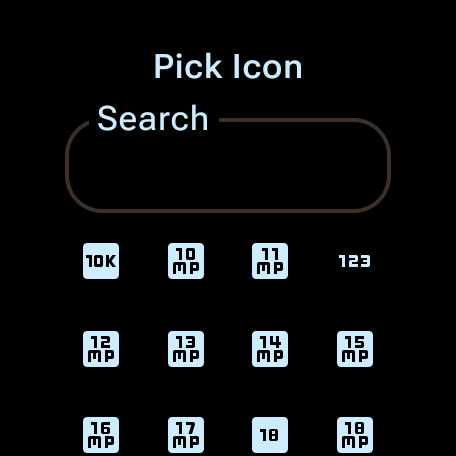
  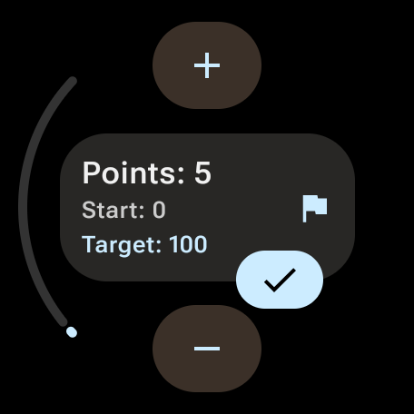
  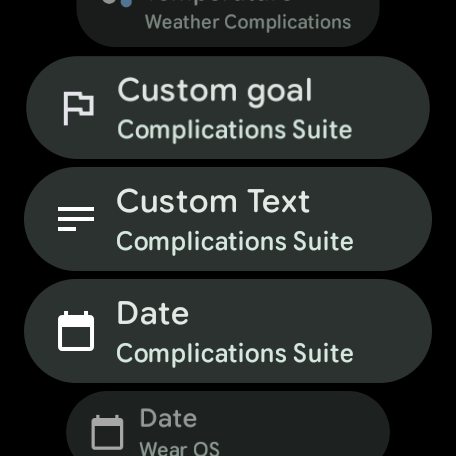
  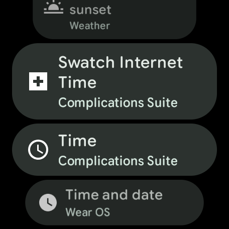
</p>
</details>

---

## 🚀 Installation & Releases

### Google Play Store
You can install the app directly on your Wear OS watch via the Play Store:
<br>
<a href='https://play.google.com/store/apps/details?id=com.weartools.weekdayutccomp'></a>

### Sideload / Manual Install
Download the compiled package (`.apk`) directly from our [Releases Page](https://github.com/amoledwatchfaces/Complications-Suite-Wear-OS/releases) and sideload it onto your watch.

---

## 🛠️ Local Build & Setup

To compile the application locally using Android Studio:

1. **Clone the repository**:
   ```bash
   git clone https://github.com/amoledwatchfaces/Complications-Suite-Wear-OS.git
   cd Complications-Suite-Wear-OS/Complications_Suite_AS
   ```
2. **Add API Keys (Optional)**:
   The app uses Google Places for location searches. You can configure your key by creating a folder named `APIs` in the root of the workspace (parent directory of `Complications_Suite_AS`) and creating a file `apis.properties` inside it:
   ```properties
   PLACES_API_KEY = "your_google_places_api_key_here"
   ```
   *Note: If you do not have an API key, the build will fallback to an empty string and compile successfully.*

3. **Build the project**:
   Use Android Studio or Gradle CLI:
   ```bash
   ./gradlew assembleDebug
   ```

---

## 🌟 Supported Complications & Types

<details>
<summary><b>Click to expand full list of complications and supported types</b></summary>

Here is the complete list of complications provided by the app and their supported types:

* **Activity launcher** - `ICON`
* **Alarm** - `ICON, SMALL_IMAGE`
* **Amoled Logo** - `ICON, SMALL_IMAGE`
* **Assistant (Monochrome)** - `ICON, SMALL_IMAGE`
* **Barometer** - `SHORT_TEXT`
* **Battery Saver settings** - `ICON`
* **BTC (Bitcoin) price** - `SHORT_TEXT, LONG_TEXT, RANGED_VALUE`
* **Bluetooth settings** - `ICON`
* **Custom text** - `SHORT_TEXT, LONG_TEXT`
* **Date** - `SHORT_TEXT, LONG_TEXT`
* **Countdown to date** - `SHORT_TEXT, LONG_TEXT, RANGED_VALUE`
* **Day and Week** - `SHORT_TEXT, LONG_TEXT`
* **Day of Year** - `SHORT_TEXT, LONG_TEXT, RANGED_VALUE`
* **Developer Options** - `ICON, SMALL_IMAGE`
* **Dice** - `ICON, SMALL_IMAGE`
* **Display settings** - `ICON`
* **Dynamic calendar icon** - `ICON, SMALL_IMAGE`
* **ETH (Ethereum) price** - `SHORT_TEXT, LONG_TEXT, RANGED_VALUE`
* **Flashlight** - `ICON, SMALL_IMAGE`
* **Custom goal** - `SHORT_TEXT, LONG_TEXT, RANGED_VALUE`
* **Date Hijri** - `SHORT_TEXT, LONG_TEXT` (optional) *by [@hamedsh](https://github.com/hamedsh)*
* **Date Jalali** - `SHORT_TEXT, LONG_TEXT` (optional) *by [@hamedsh](https://github.com/hamedsh)*
* **Wear OS logo** - `ICON, SMALL_IMAGE`
* **Moon Phase** - `SHORT_TEXT, LONG_TEXT, RANGED_VALUE, ICON, SMALL_IMAGE`
* **Moonrise & Moonset** - `SHORT_TEXT, LONG_TEXT, RANGED_VALUE`
* **NFC settings** - `ICON`
* **Pay** - `ICON, SMALL_IMAGE`
* **Seconds** - `SHORT_TEXT, LONG_TEXT, RANGED_VALUE`
* **Settings** - `ICON`
* **Sunrise & Sunset** - `SHORT_TEXT, LONG_TEXT`
* **Sunrise & Sunset countdown** - `SHORT_TEXT, LONG_TEXT, RANGED_VALUE`
* **Time** - `SHORT_TEXT, LONG_TEXT, RANGED_VALUE`
* **Timer** - `SHORT_TEXT, RANGED_VALUE`
* **Time zone** - `SHORT_TEXT, LONG_TEXT`
* **Volume control** - `ICON, SMALL_IMAGE`
* **Water intake** - `SHORT_TEXT, LONG_TEXT, RANGED_VALUE, ICON, SMALL_IMAGE`
* **Week of Year** - `SHORT_TEXT, LONG_TEXT, RANGED_VALUE, ICON, SMALL_IMAGE`
* **Wi-Fi settings** - `ICON`
* **World Clock 1** - `SHORT_TEXT, LONG_TEXT`
* **World Clock 2** - `SHORT_TEXT, LONG_TEXT`

</details>

---

## 📄 License

```text
“Commons Clause” License Condition v1.0

The Software is provided to you by the Licensor under the License, as defined below, subject to the following condition.

Without limiting other conditions in the License, the grant of rights under the License will not include, and the License does not grant to you, right to Sell the Software.

For purposes of the foregoing, “Sell” means practicing any or all of the rights granted to you under the License to provide to third parties, for a fee or other consideration (including without limitation fees for hosting or consulting/ support services related to the Software), a product or service whose value derives, entirely or substantially, from the functionality of the Software. Any license notice or attribution required by the License must also include this Commons Cause License Condition notice.

Software: Complications Suite - Wear OS
License: Apache-2.0
Licensor: amoledwatchfaces™

Copyright (c) 2024 - 2026 amoledwatchfaces™
```

Licensed under the Apache License, Version 2.0 (the "License"); you may obtain a copy of the License at:
http://www.apache.org/licenses/LICENSE-2.0

Unless required by applicable law or agreed to in writing, software distributed under the License is distributed on an "AS IS" BASIS, WITHOUT WARRANTIES OR CONDITIONS OF ANY KIND, either express or implied.
